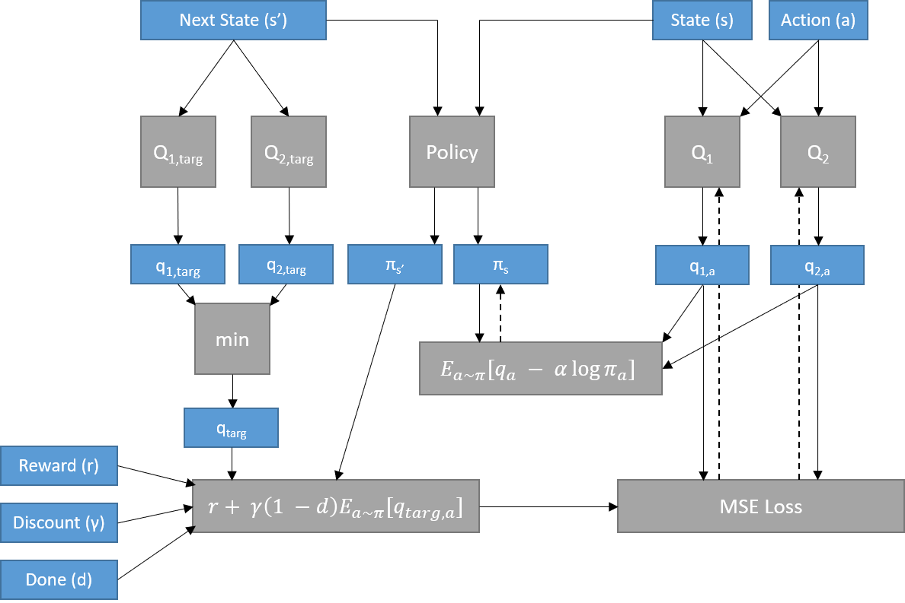
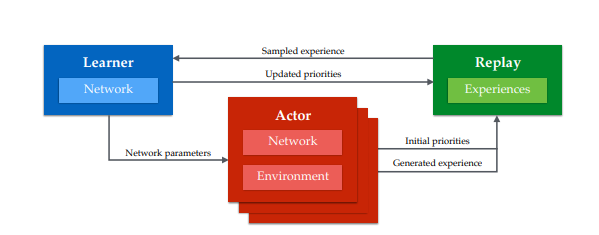

# Soft Actor-Critic

## Description
Soft actor-critic is a SOTA reinforcement learning algorithm that modifies the classic reinforcement learning objective -expected return maximization- with an added entropy term that encourages the policy to maintain a hyperparameterized degree of randomness. This objective balances exploration and exploitation depending on what has been learned about a given state, and provides smoother transitions between action determinations while learning compared to epsilon-greedy policies, which may jarringly switch the action taken in a given state when the maximum Q-value changes. Besides the entropy modification, SAC includes other recent advancements in DQN frameworks to improve training stability:

* Jointly learns policy and state-action values for faster convergeance on solution
* Learns off policy for maximum sampling efficiency
* Utilizes clipped double-Q, similar to TD3
* Soft updates of target networks, rather than scheduled updates

One update step of SAC, shown below, depends on a stored (s, a, r, s') transition to train two Q-networks and a policy network. Entropy in the policy network is maintained with a temperature parameter alpha, which is also learnable. The two Q-target networks are updated by Polyak averaging at every step with the true Q-networks. Gradients are shown with dashes.

 Figure 1. SAC algorithm

My implementation of SAC is modified to work with discrete action spaces and Dueling Q-networks. The authors of the SAC paper state that the use of a dedicated target value network improves the stability of training, but I hypothesize this value network can be eliminated with the use of Dueling Q-networks, also implemented in this repo, which include a value stream as part of their formulation. 

I plan to combine the SAC framework with distributed prioritized replay (Fig. 3), recently shown to vastly improve training speed of DeepRL agents, and recent advancements in sequence-processing neural networks to create a SOTA reinforcement learing algorithm for discrete action spaces. Namely, I plan to implement a new style of Q and policy networks that moves away from the stacked-frames convolutional and recurrent mechanisms used in the past to plan from a series of past states. Instead, I will use the self-attention mechanism found in transformer models, which are faster and have longer memory than recurrent mechansisms. Additionally, I plan to maintain the volume-dimensionality of spatially-distributed image data in my Transformer model, rather than embedding the image state into a 1D vector. Maintaining spatial structure may aid in deriving value from memories of past states (Fig. 2). I believe the combination of SAC, distributed prioritized replay, state-transformer networks, and dueling Q-networks will produce a new SOTA benchmark.

 Figure 2. State transformer model.  

 Figure 3. Distributed prioritized experience replay with Actor-Learner framework. The Learner module may be duplicated many times to increase rate of experience.

## Progress

I have implemented and trained SAC agents in sequential and markovian environments with prioritized replay. Next, I must finish setting up the distributed Actor-Memory-Learner architecture by writing a threadsafe memory process. Following this, I will compare training of LSTM and Transformer models in Atari Arcade environments.

## References

1. <a href="https://openreview.net/pdf?id=H1Dy---0Z">DISTRIBUTED PRIORITIZED EXPERIENCE REPLAY</a>
2. <a href="https://openreview.net/forum?id=r1lyTjAqYX">Recurrent Experience Replay in Distributed Reinforcement Learning</a>
3. <a href="https://arxiv.org/abs/1801.01290">Soft Actor-Critic: Off-Policy Maximum Entropy Deep Reinforcement Learning with a Stochastic Actor</a>
4. <a href="https://arxiv.org/pdf/1910.07207.pdf">SOFT ACTOR-CRITIC FOR DISCRETE ACTION SETTINGS</a>