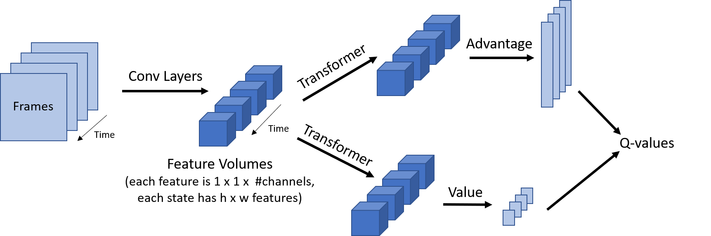

# Soft Actor-Critic

## Description
Soft actor-critic is a SOTA reinforcement learning algorithm that modifies the classic reinforcement learning objective -expected return maximization- with an added entropy term that encourages the policy to maintain a hyperparameterized degree of randomness. This objective balances exploration and exploitation depending on what has been learned about a given state, and provides smoother transitions between action determinations while learning compared to epsilon-greedy policies, which may jarringly switch the action taken in a given state when the maximum Q-value changes. Besides the entropy modification, SAC includes other recent advancements in DQN frameworks to improve training stability:

* Jointly learns policy and state-action values for faster convergeance on solution
* Learns off policy for maximum sampling efficiency
* Utilizes clipped double-Q, similar to TD3
* Soft updates of target networks, rather than scheduled updates

My implementation of SAC is modified to work with discrete action spaces and Dueling Q-networks. The authors of the SAC paper state that the use of a dedicated value network improves the stability of training, but I hypothesize this value network can be eliminated with the use of Dueling Q-networks, also implemented in this repo, which include a value stream as part of their formulation. 

I plan to combine the SAC framework with distributed prioritized replay and recent advancements in sequence-processing neural networks to create a SOTA reinforcement learing algorithm for discrete action spaces. Namely, I plan to implement a new style of Q and policy networks that moves away from the stacked-frames convolutional and recurrent mechanisms used in the past to plan from a series of past states. Instead, I will use the self-attention mechanism found in transformer models, which are faster and allow for easier backpropagation through time than recurrent mechansisms. I believe the combination of SAC, distributed prioritized replay, state-transformer networks, and dueling Q-networks will produce a new SOTA benchmark.

My work is based off Google's recently-released R2D2 model, which showed massive performance gain from distributed prioritized replay and the use of LSTMs to estimate Q-values from multiple states. I plan to substitute their DDQN architecture with SAC, and their LSTM models with my own feature-by-feature-over-time Transformer network, which uses a convolution network to embed image states, then employs self-attention and dense layer to calculate Q-values. The architecture is shown below:

## TO DO:
1. Test transformer vs. LSTM sequential models
2. Implement Actor-distributed training

